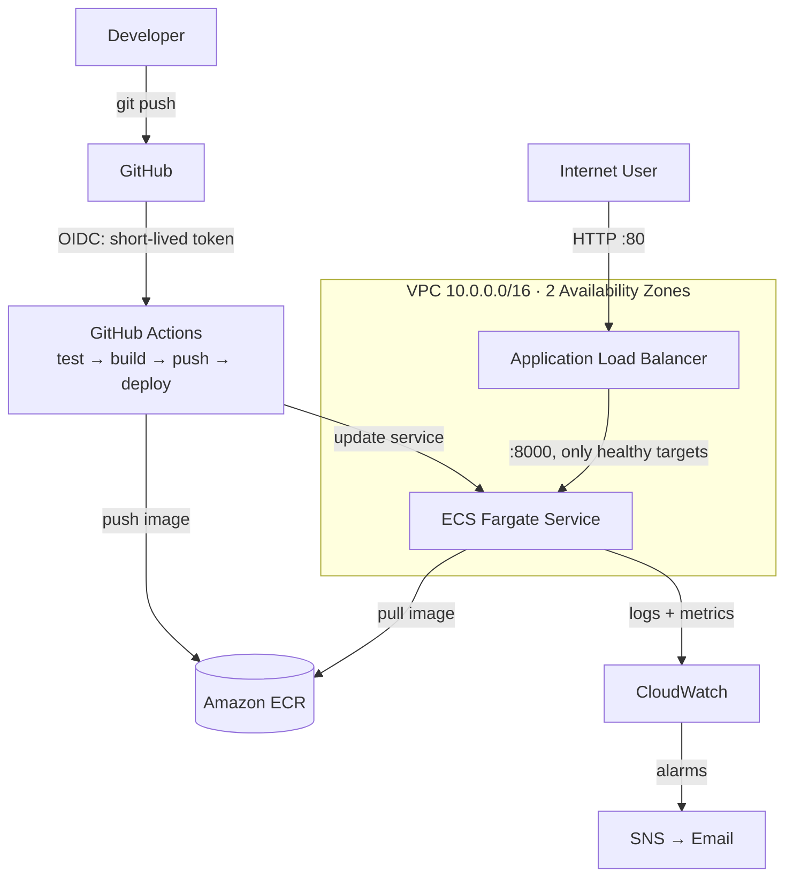

# Cloud API — Containerised Service on AWS ECS Fargate

A production-style REST API deployed to AWS using **Infrastructure as Code** and a fully automated **CI/CD pipeline**. Built to demonstrate end-to-end cloud engineering: containerisation, networking, orchestration, observability, security, and keyless automated deployment.

**Live stack:** FastAPI · Docker · AWS ECS Fargate · Application Load Balancer · Terraform · GitHub Actions (OIDC)

---

## Architecture



The application runs as a container on **ECS Fargate** (serverless containers) across two Availability Zones, behind an **Application Load Balancer** that health-checks `/health` and routes only to healthy tasks. All infrastructure is defined in **Terraform**. Every push to `main` triggers **GitHub Actions**, which authenticates to AWS via **OIDC** (no stored keys), runs tests, builds and pushes the image to **ECR**, and deploys to ECS.

---

## Key Features

- **Infrastructure as Code** — the entire AWS environment (VPC, subnets, ALB, ECS, IAM, monitoring) is defined in Terraform and reproducible with one command.
- **CI/CD pipeline** — automated test, build, and deploy on every push via GitHub Actions.
- **Keyless authentication** — GitHub authenticates to AWS using OIDC short-lived tokens; no long-lived credentials are stored anywhere.
- **High availability** — runs across two Availability Zones behind a load balancer.
- **Observability** — CloudWatch dashboard (request count, errors, latency, CPU/memory) and alarms that email on 5xx errors, unhealthy hosts, or high CPU.
- **Security by default** — least-privilege IAM roles, security groups that allow tasks only from the ALB, and HTTPS-only egress.
- **Production container** — multi-stage Docker build, non-root user, ~60MB image, with a health check.

---

## Tech Stack

| Layer | Technology |
|-------|-----------|
| Application | Python 3.12, FastAPI, Uvicorn |
| Container | Docker (multi-stage, non-root) |
| Registry | Amazon ECR (vulnerability scanning on push) |
| Compute | AWS ECS Fargate |
| Networking | VPC, public subnets (2 AZs), Application Load Balancer |
| IaC | Terraform (AWS + TLS providers) |
| CI/CD | GitHub Actions with OIDC |
| Observability | Amazon CloudWatch (dashboard, alarms), SNS |

---

## Project Structure

```
cloud-api/
├── app/                      # FastAPI application
│   └── main.py
├── tests/                    # pytest test suite
├── terraform/                # all infrastructure as code
│   ├── vpc.tf                # network: VPC, subnets, routing
│   ├── security_groups.tf    # firewalls (ALB + tasks)
│   ├── alb.tf                # load balancer + target group
│   ├── ecs.tf                # cluster, task definition, service
│   ├── ecr.tf                # container registry
│   ├── iam.tf                # task execution + task roles
│   ├── github_oidc.tf        # keyless CI/CD auth
│   ├── monitoring.tf         # CloudWatch alarms + SNS
│   └── dashboard.tf          # CloudWatch dashboard
├── .github/workflows/
│   └── deploy.yml            # CI/CD pipeline
├── Dockerfile                # multi-stage, non-root
└── README.md
```

---

## Deployment

**Prerequisites:** AWS account, AWS CLI configured, Terraform ≥ 1.5, Docker.

```bash
# 1. Provision all infrastructure
cd terraform
terraform init
terraform apply

# 2. Push the first image (subsequent deploys are automatic via CI/CD)
aws ecr get-login-password --region eu-west-2 | docker login --username AWS \
  --password-stdin 109152774868.dkr.ecr.eu-west-2.amazonaws.com
docker build -t cloud-api .
docker tag cloud-api:latest 109152774868.dkr.ecr.eu-west-2.amazonaws.com/cloud-api:latest
docker push 109152774868.dkr.ecr.eu-west-2.amazonaws.com/cloud-api:latest

# 3. Get the public URL
terraform output alb_dns_name
```

From then on, **every push to `main` deploys automatically** — no manual steps.

**Endpoints:** `/` · `/health` · `/api/info` · `/docs` (Swagger UI)

**Teardown:** `terraform destroy` removes the entire stack and stops all charges.

---

## Design Decisions

- **ECS Fargate over EKS** — serverless containers avoid managing a Kubernetes control plane; the right level of complexity for this workload.
- **OIDC over stored keys** — eliminates long-lived AWS credentials in GitHub, reducing breach risk; the IAM role is scoped to only this repo's `main` branch.
- **Public subnets + `assign_public_ip`** — a cost-conscious choice for a demo (avoids NAT Gateway charges); production would use private subnets with a NAT Gateway or VPC endpoints.
- **`latest` + commit-SHA image tags** — every deployment is traceable to an exact commit for debugging and rollback.
